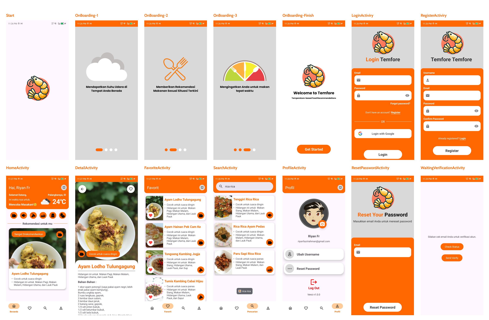

# Temfore: Mobile Development

Temfore is a mobile application developed to provide food recommendations based on the air temperature at the user's location. The app suggests recipes with ingredients and cooking instructions tailored to the current weather, making it easier for users to decide what to cook based on the temperature. The application integrates weather data and machine learning to generate personalized recommendations.

[](https://www.figma.com/board/kk1GoJZcXCeFLDyCRNRiCg/Project-Plan?node-id=1-357&t=FSVm0qZaa2Je8hZn-1)  
[](https://www.figma.com/design/ZN2GS2mXkTM5ssUM3Kr4IW/Project-Capstone?node-id=0-1&t=YvxR49v6gj2VTm4m-1)

## C242-PS547

### Team Members

| Status   | Path | Name                         | Bangkit ID     | University                    | LinkedIn                                                                        | GitHub                                        |
| -------- | ---- | ---------------------------- | -------------- | ----------------------------- | ------------------------------------------------------------------------------- | --------------------------------------------- |
| `Active` | (CC) | Nurminati Hasnatul Khatimah  | `C247B4KX2427` | Universitas Lambung Mangkurat | [LinkedIn](https://www.linkedin.com/in/nurminati-hasnatul-khatimah-704b69244/)  | [GitHub](https://github.com/minacloe)         |
| `Active` | (CC) | Muhammad Adji Maulana Putera | `C247B4KY2686` | Universitas Lambung Mangkurat | [LinkedIn](https://www.linkedin.com/in/muhammad-adji-maulana-putera-514066252/) | [GitHub](https://github.com/adjimaulanap)     |
| `Active` | (ML) | Balladiva Mahesi             | `M008B4KX0804` | Universitas Gadjah Mada       | [LinkedIn](https://www.linkedin.com/in/balladiva-mahesi-428a16256/)             | [GitHub](https://github.com/bldv)             |
| `Active` | (ML) | Alif Rahmatullah Lesmana     | `M668B4KY0386` | STMIK Palangka Raya           | [LinkedIn](https://www.linkedin.com/in/alif-rahmatullah-lesmana-565028311/)     | [GitHub](https://github.com/Peparrepair)      |
| `Active` | (ML) | Muhammad Raffa Saputra       | `M668B4KY2987` | STMIK Palangka Raya           | [LinkedIn](https://www.linkedin.com/in/muhammad-raffa-saputra21/)               | [GitHub](https://github.com/21YeetYa)         |
| `Active` | (MD) | Riyan Fazri Rahman           | `A668B4KY3894` | STMIK Palangka Raya           | [LinkedIn](https://www.linkedin.com/in/riyan-fazri-rahman/)                     | [GitHub](https://github.com/riyanfazrirahman) |

---

## 🛠️ **Features of the App**

- **Weather-based food recommendations**: The app suggests food recipes based on the temperature of the user's current location.
- **User authentication**: Users can log in using Firebase Authentication.
- **Profile management**: Users can manage their profiles, which include saved favorite recipes.
- **Recipe search**: Users can search for recipes based on ingredients or recipe names.
- **Favorite recipes**: Users can mark their favorite recipes to view later.
- **Machine Learning-based Recommendations**: The app uses machine learning models to generate accurate food suggestions.
- **Meal Reminder Notifications**: The app provides timely reminders for meals using WorkManager:

    | Time Range         | Meal         | Description             |
    |---------------------|--------------|-------------------------|
    | **6:00 AM - 9:00 AM** | Breakfast    | Reminder to have breakfast. |
    | **11:00 AM - 1:00 PM**| Lunch        | Reminder to have lunch.     |
    | **6:00 PM - 8:00 PM** | Dinner       | Reminder to have dinner.    |



## **💡 Code Highlights**
Here are some important code snippets that power the functionality of the app.

### `getLastLocation()`
```kotlin
fusedLocationClient.lastLocation.addOnCompleteListener(requireActivity()) { task: Task<Location?> ->
    if (task.isSuccessful) {
        val location = task.result
        if (location != null) {
            val latitude = location.latitude
            val longitude = location.longitude
            fetchWeatherByCoordinates(latitude, longitude) 
        } 
    }
}
```
Functionality:
- Retrieves the user's last known location using fusedLocationClient.
- Passes the coordinates (latitude, longitude) to fetchWeatherByCoordinates() if the location is successfully fetched.
---
### `fetchWeatherByCoordinates(latitude: Double, longitude: Double)`

```kotlin
private fun fetchWeatherByCoordinates(latitude: Double, longitude: Double) {
    Log.d(TAG, "API request Weather......................")
    weatherViewModel.fetchWeatherByCoordinates(latitude, longitude)
    fetchFoodRecommendations()
}
```
Functionality:
- Logs the start of the weather API request.
- Fetches weather data using weatherViewModel.
- Calls fetchFoodRecommendations() to generate food recommendations based on weather data.
---
### `fetchFoodRecommendations()`

```kotlin
private fun fetchFoodRecommendations() {
    Log.d(TAG, "API request Recommend......................")
    recommendationViewModel.fetchRecommendations(categoryUser, tempUser, timeUser)
}
```
Functionality:

- Logs the start of the recommendation API request.
- Fetches food recommendations using user preferences (`categoryUser`) and weather data (`tempUser`, `timeUser`).
---
### `scheduleNotification()` & `showNotification()`

```kotlin
private fun scheduleNotification(context: Context) {
    val workRequest = PeriodicWorkRequestBuilder<NotificationWorker>(15, TimeUnit.MINUTES).build()
    WorkManager.getInstance(context).enqueueUniquePeriodicWork("NotificationWork1", ExistingPeriodicWorkPolicy.KEEP, workRequest)
}
```
```kotlin
private fun showNotification(context: Context) {
    val calendar = Calendar.getInstance()
    val currentHour = calendar.get(Calendar.HOUR_OF_DAY)
    val message = when (currentHour) {
        in 6..9 -> "Sarapan Pagi!🥪"
        in 11..13 -> "Makan Siang!🧺"
        in 18..20 -> "Makan Malam!🍴"
        else -> { return }
    }
}
```
Functionality:
- Schedules periodic notifications using WorkManager.
- Ensures the notification is triggered every 15 minutes (or at specified intervals).
- Determines the current time and displays a notification with an appropriate message.
---

# **🔍 Comparison of Temfore's Advantages**

| **Key Features**                        | **Temfore** | **Similar Apps**     | **Description**                                                                                                  |
|-----------------------------------------|-------------|-----------------------|------------------------------------------------------------------------------------------------------------------|
| **Weather-Based Recommendations**       | ✔           | ✘                     | Temfore uses real-time weather data, while similar apps do not consider weather conditions.                     |
| **Machine Learning Integration**        | ✔           | ✘                     | Temfore leverages ML for personalized recommendations, whereas other apps often rely on basic logic.            |
| **Meal Reminder Notifications**         | ✔           | ✘                     | Meal reminders for breakfast, lunch, and dinner at specific times are not available in similar apps.            |
| **Recipe Search**                       | ✔           | ✔                     | Both apps support recipe searches, but Temfore is more flexible by allowing searches by ingredients.            |
| **Favorite Recipes**                    | ✔           | ✘                     | Favorite recipes in Temfore are accessible offline, while other apps often require an internet connection.      |
| **User Interface (UI/UX)**              | ✔           | ✘                     | Temfore features a modern and intuitive design, whereas many similar apps have complex interfaces.              |
| **API Efficiency**                      | ✔           | ✘                     | Temfore combines weather and recommendation API calls, while similar apps often separate these processes.       |
| **User Login and Profile Management**   | ✔           | ✘                     | Temfore supports Firebase login and profile management, whereas many other apps are local-only.                 |

## Conclusion
Temfore excels in providing weather-based recommendations, API efficiency, and additional features like notifications and personalized profile management.
